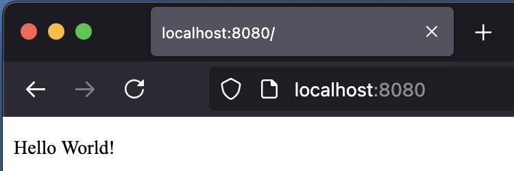

# README

### Brief
My work-in-progress web server in C++ mostly for practice (_maybe_ for personal use later). See the below notes for important information and tips.

### Requirements
 - A *nix system
 - Any modern C++ compiler
 - CMake 3.28+

### Get Started
 1. Clone this repo onto your system.
 2. Get `utility.sh` execute permissions, and run `./utility.sh help` within your terminal for usage tips.
 3. Build the program with that shell script.
 4. Run `./build/src/myhttpd <port> <worker-count> <client-timeout>` and feel free to use cURL or a web browser.

### My To-Do's
 - [x] Refactor server into a multithreaded one using a thread pool.
 - [] Add URI parsing
 - [] Add cache header support
 - [] Add application handlers
